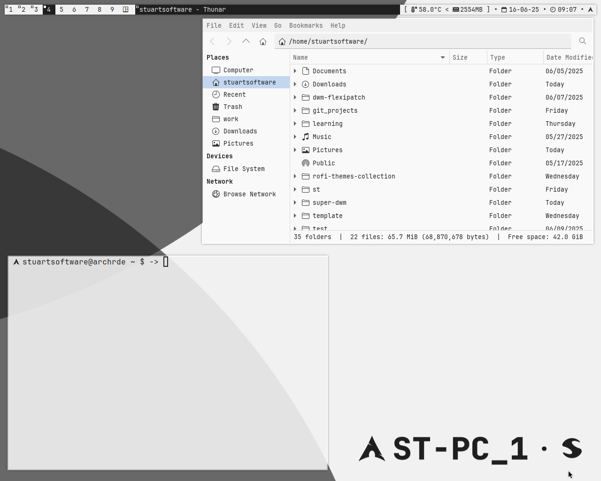

# super-dwm a dwm config by stuartsoftware

It's just my window manager config, enjoy using it, I tried to make minimal customizations

## Observation
dwmbar.sh possibly have bugs, because it uses xsetroot and if you use another distro that doesn't Arch or Debian, maybe you'll need to modify them yourself.

## Screenshots

## Instalation

I'm going to explain to you as you have installed a minimum instalation of a Linux Distro
You need the following libraries or dependences...

`git gcc make libX11 libXft libXinerama`

After install those libraries you just need to run:

`./install.sh`

Because, I modified the Makefile to make installation easier.

## Clone the repository

`git clone https://github.com/stuartsoftware/super-dwm`

### Then, do this

`cd super-dwm`
`./install.sh`

## Required libraries and dependences

On Arch Linux (i use arch btw), you need these for Thunar 

(If you don't install them you won't be able to save files from browser, etc...)

`xdg-desktop-portal xdg-desktop-portal-gtk`

and this to enable thumbnails in Thunar

`tumbler`

## Packages

These are the packages I use, use pkg_debian.sh or pkg_arch.sh to install them or DIY (if you use another distro :P) also
helps you to install the libraries (from Instalation):

    * Thunar (File Manager)
    * xfce4-screenshooter (Take Screenshots dah!)
    * lxappeareance-gtk3 (Customize Thunar or GTK aplication) this is for arch (Debian uses install lxappearance)
    * fastfetch (yes)
    * nvim (for coding like a pro)
    * alacritty (Terminal Emulator)
    * redshift (For you eyes <3)
    * pavucontrol (Volume Control)
    * rofi (open apps)
    * picom (transparency and animations)
    * arandr (GUI of xrandr to configure multiple monitors)
    * dunst (for notifications)
    
These are essential... if I install another pkg or change one of these, I'll upgrade this .md

## HotKeys

The same of dwm (RTFM! jk) but I use these (nuts) ones:

    *SUPER + SHIFT + Y* closes dwm, or logout (You get back to tty or your dm)
    *SUPER + D* opens rofi
    *SUPER + E* opens Thunar
    *SUPER + ENTER* opens Alacritty 
    *SUPER + P* opens xfce4-screenshooter

If you use alacritty you can see superhelp.sh pressing SUPER + F1 or you can run it in the super-dwm folder
I don't use hotkeys for volume rn... I use pavucontrol but you can do it modiying config.h or using another program

## Personalize 

I'll figure out how to have theme on dwm... so the current theme is modified directly in config.h 

### Font

I use JetBrainsMono Nerd Font 

### GTK3 Theme

I use Materia Theme

### Icons

I use WhiteSur (MacOS-like)
